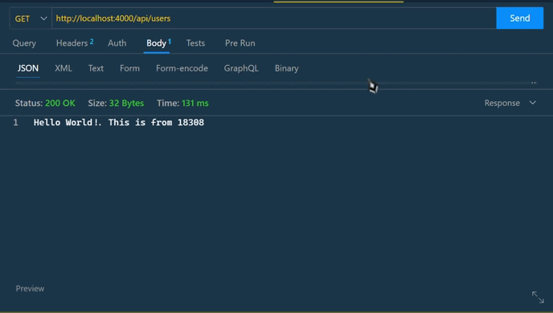
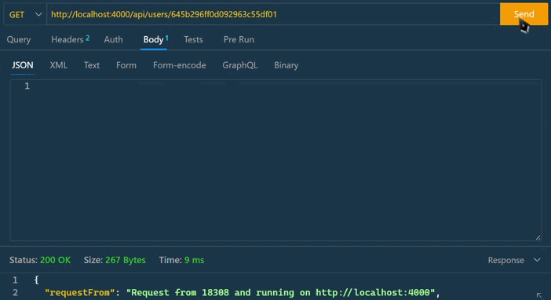
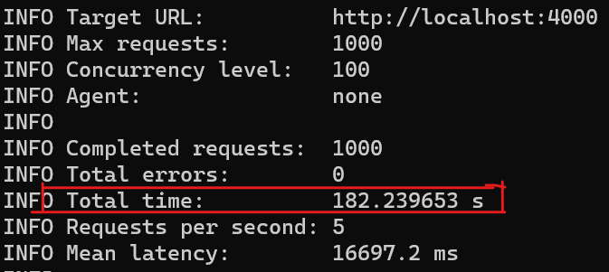
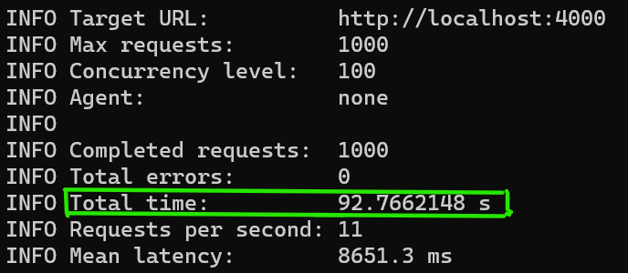
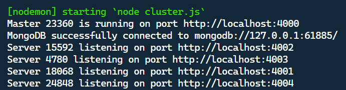
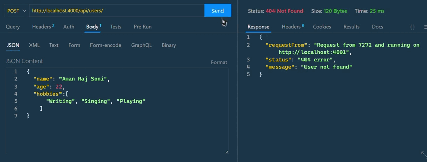

## The task is to implement simple CRUD API using in-memory database underneath and also implement horizontal scaling for application using the Node.js `Cluster` API with a **load balancer**

First we have to setup a basic app to implement the CRUD operations.

- **Step 1** <u> [Installing Dependencies](https://github.com/anmolrajsoni15/Ticktech-Assignment/blob/main/backend/package.json) </u>
  To install the dependencies just run `npm i`
  This program compraises of following dependencies.
  - express (to run the nodejs app)
  - dotenv (to parse the env files)
  - mongoose and mongodb-memory-server (to setup the in-memory database)
  - nodemon (to run the server on development site)
  - loadtest (to test the server in case of clustering)

- **Step 2** <u> [Create a basic server and connect Database](https://github.com/anmolrajsoni15/Ticktech-Assignment/blob/main/backend/config/database.js)</u>
  Here we are using in-memory database. (`An in-memory database stores data in the computer’s main memory instead of on a disk, making it faster than traditional databases.`)
  In my project I am using `mongodb-memory-server` as my in-memory database. It is preety simple to setup mongoDB in-memory database.

    ```
    const {MongoMemoryServer} = require('mongodb-memory-server');

    const mongoose = require('mongoose');

    exports.connectDatabase = async() => {
        const mongoServer = await MongoMemoryServer.create();
        const mongoUri = mongoServer.getUri();

        await mongoose.connect(mongoUri, {dbName: "testingDB"});
        console.log(`MongoDB successfully connected to ${mongoUri}`);
    }
    ```

    This code helps to create a new memory server everytime user restarts the server.
<br>

- **Step 3** <u> [Create User Model](https://github.com/anmolrajsoni15/Ticktech-Assignment/blob/main/backend/models/userModel.js) </u>
  The user model basically contains three components
  1. name : String
  2. age : Number
  3. hobbies : Array of strings
<br>

- **Step 4** <u>[Create different API request](https://github.com/anmolrajsoni15/Ticktech-Assignment/blob/main/backend/controllers/userController.js)</u>
  The application have basically 5 endpoints.
    1. **GET** `api/users` is used to get all persons
        - Server returns answer with `status code` **200** and all users records
    2. **GET** `api/users/{userId}`
        - Server returns answer with `status code` **200** and record with `id === userId` if it exists
        - Server returns answer with `status code` **400** and corresponding message if `userId` is invalid.
        - Server returns answer with `status code` **404** and corresponding message if record with `id === userId` doesn't exist
    3. **POST** `api/users` is used to create record about new user and store it in database
        - Server returns answer with `status code` **201** and newly created record
        - Server returns answer with `status code` **400** and corresponding message if request `body` does not contain **required** fields
    4. **PUT** `api/users/{userId}` is used to update existing user
        - Server returns answer with`status code` **200** and updated record
        - Server returns answer with`status code` **400** and corresponding message if `userId` is invalid
        - Server returns answer with`status code` **404** and corresponding message if record with `id === userId` doesn't exist
    5. **DELETE** `api/users/{userId}` is used to delete existing user from database
        - Server returns answer with `status code` **204** if the record is found and deleted
        - Server returns answer with `status code` **400** and corresponding message if `userId` is invalid.
        - Server returns answer with `status code` **404** and corresponding message if record with `id === userId` doesn't exist
<br>

- **Step 5** <u> [Handle Errors](https://github.com/anmolrajsoni15/Ticktech-Assignment/blob/main/backend/middlewares/error.js) </u>
  - Handle ***non-existing endpoints***

    ```
    app.use((req, res, next) => {
        res.status(404).send('Sorry, we could not find the page you were looking for!');
    });
    ```

    If a user goes to some random endpoints the server returns a user friendly message like `Sorry, we could not find the page you were looking for!`

  - Handle ***Errors on the server side***

    ```
    function handleError(err, req, res, next) {
        if (res.headersSent) {
            return next(err);
        }

        console.error(err.stack);
        res.status(500).send('Something went wrong on the server!');
    }
    ```

<br>

- **Step 6** <u> [Set up the program for testing]() </u>
  The application runs in two mode i) Production ii) Development.
  Add the following code in your `package.json` file

  ```
  "scripts": {
    "start": "node server.js", // to run the program in production mode
    "server": "nodemon server.js" // to run the program in development mode.
  }
  ```
  
  <u>**Working of Api**</u>
  
  - Firstly when we do the get request on `http://localhost:4000/api/users` we get an empty array of users.
  - Then we make **POST** request to add user.
  - After adding some users when we do **GET** request we get the users with status code 200.
  - Now comes the part of working on individual user i.e., `http://localhost:4000/api/users/{userId}`
    <br>
    
    - We can **GET** a particular user details by adding userId on the url.
    - We can also update user detail by making **PUT** request on url by passing userId
    - On applying **DELETE** request to that user, the user gets deleted and if we make **GET** request now we will get **404** page with massage ***User not Found***
<br>

- **Step 7** [Implement Horizontal Scaling]()
  To implement Horizontal Scaling in my program I have used **Nodejs Clustering** method which runs multiple instances of the application with a **load balancer**.
  &nbsp;
  Now the question are arrised why we need to implement horizontal scaling. Let's understand it by runnig loadtest on the server.
  After starting the server run the command `npx loadtest -n 1000 -c 100 http://localhost:4000` on the terminal.
  <div style="text-align: center; width: 80%; margin: 0px auto;">
    
    <div style="font-size: 12px;">
      <u>LoadTest without Clustering</u>
    </div>
  </div>
  &nbsp;

  <div style="text-align: center; width: 80%; margin: 0px auto;">
    
    <div style="font-size: 12px;">
      <u>LoadTest after Clustering</u>
    </div>
  </div>
  &nbsp;
  We can clearly see that the time reduces drastically to just half after clustering. Initially it was taking approx 182s and after load balancing it is reduced to just 92.76s.

  &nbsp;
  To run the multiple instances of application add `multi: "nodemon cluster.js"` in your script tag in package.json file.
  Here cluster.js is a file which runs the multiple instances of the program. First if checks if the cluster is Master, if it is then it distributes the works via load balancer (which works on Round-Robin approach) to workers i.e., all the instances of the cpu present in the user's system. In my case, my system has 4 instances of cpu.
    
  - On `localhost:4000/api` load balancer is listening for requests
  - On `localhost:4001/api`, `localhost:4002/api`, `localhost:4003/api`, `localhost:4004/api` workers are listening for requests from load balancer.
  - When user sends request to `localhost:4000/api`, load balancer sends this request to `localhost:4001/api`, next user request is sent to `localhost:4002/api` and so on.

  &nbsp;
  Lets see the working to understand more properly.
  

  &nbsp;
  &nbsp;
  &nbsp;

#### Thats all from my side. It was an amazing Assignment to work upon. I got to learn new concepts and enjoyed working on it
